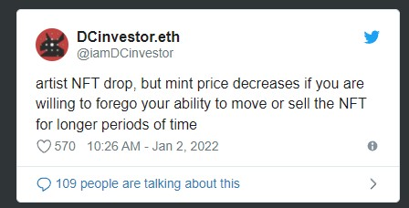
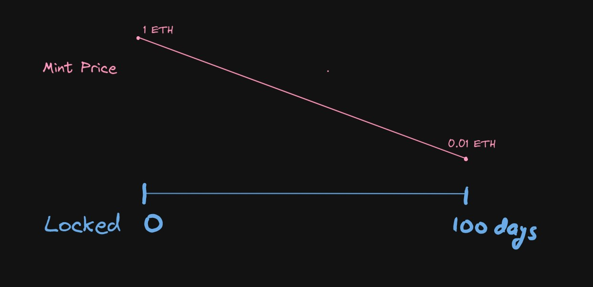
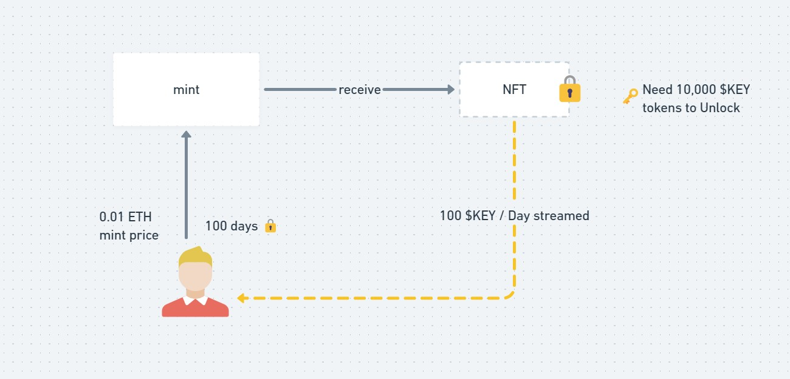

# veNFT

A mechanism to incentivize long term holding of NFTs, by locking them in the users' wallet in return for lower minting fees.

 
The mint price of NFTs is inversely proportional to the number of days the user is willing to lock their NFT:  

  

In order to unlock their NFT, the user needs to burn the required amount of $KEY tokens:
  

 
The $KEY tokens begin streaming to the user's wallet at a fixed rate, after the mint.
 
This opens up a new tokenomics game, where some users might be willing to instantly unlock their NFTs. So they'll need to buy $KEY from some other user and then burn it to unlock.
This results in the following:

1. The user that unlocked early, gives up their future allocation of $KEY tokens as the stream is stopped, bringing the total future supply of $KEY down.
2. This means that some NFTs would get locked forever, as now there won't be enough $KEY ever to unlock all the NFTs due to people unlocking before the intended lock duration.
   This boosts up the NFT scarcity in a way.
